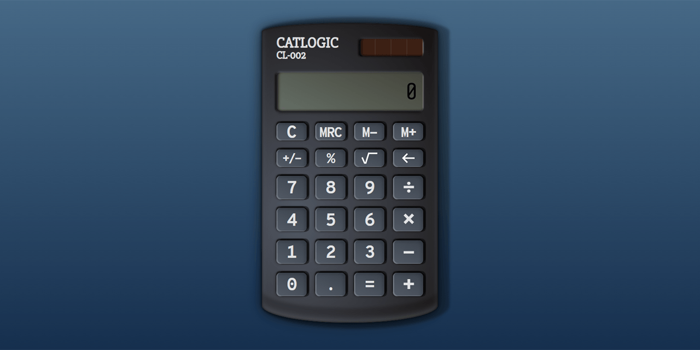

# CatLogic CL-002 Calculator
**Self-study React Project**

### About

A React calculator with a few advanced functions.
* Current live version at https://cat-street.github.io/cl-002-calculator/
* How-to blog (design-related) [at Dev.to](https://dev.to/cat__logic/styling-the-catlogic-calculator-in-css-d7i)

### Under the hood

* React, JavaScript ES6 syntax, CSS3 + semantic HTML5
* Big.js library used calculations (fixes JS decimal numbers precision problem)
* Errors for dividing by zero and for square root for negative values.
* Memory function
* Backspace functionality
* Imitates a behavior of a real-life calculator
* Immediate execution logic
* Supports chain operations without pressing 'equals' and multiple 'equals' pressing.
* Designed by pure CSS shadows and borders.
* HTML/CSS naming by BEM.

### To-do

* Keyboard input
